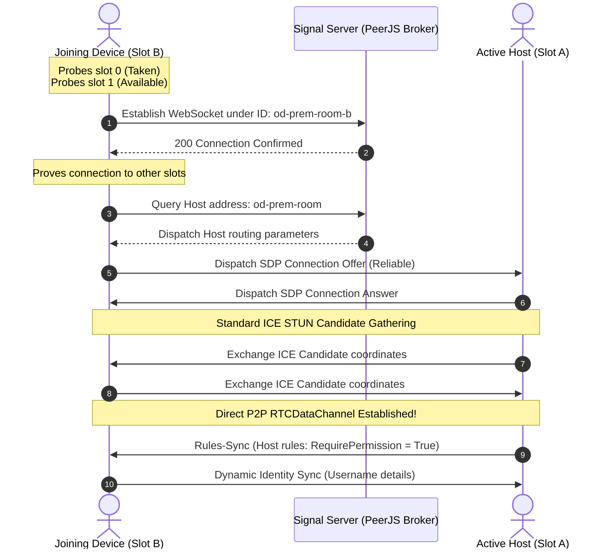
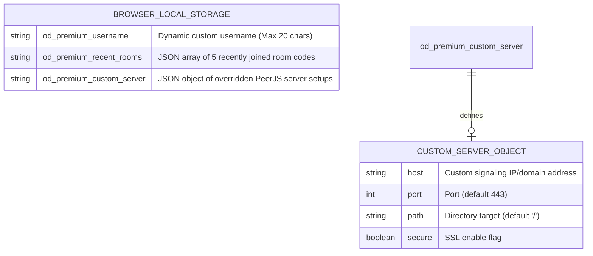

# OpenDrop Revamp: Technical Architecture & System Design Specs

This document provides a highly polished, recruiter-safe technical specification of the revamped **OpenDrop** architecture. It details the decentralized communication protocols, client-side data persistence schemas, and signaling message contracts.

---

## 1. System Topology & Data Flow Orchestration

OpenDrop is designed as a fully serverless, decentralized, client-to-client (P2P) file distribution network. It replaces centralized cloud storage stars with direct full-mesh WebRTC topology tunnels.

### A. Connection Negotiation Sequence
The sequence diagram below represents the handshaking, slot probing, and fallback signaling flows that occur when establishing direct client-to-client pipes.



### B. WebRTC Full-Mesh Connection Matrix

Unlike centralized server architectures that route data through a single star point, OpenDrop establishes direct, bidirectional `RTCDataChannel` connections between every single device in the room. This direct mesh eliminates server bottlenecks and guarantees maximum local throughput.

For $N$ active devices connected to a room, the connection density scales quadratically according to the combinations formula:

$$C = \frac{N(N - 1)}{2}$$

This means that a fully occupied 4-device mesh hosts exactly 6 active direct channels. Below is the connectivity matrix mapping direct data tunnels between active slots:

| Device Slot | Host (Slot `""`) | Peer 1 (Slot `"b"`) | Peer 2 (Slot `"c"`) | Peer 3 (Slot `"d"`) |
| :--- | :--- | :--- | :--- | :--- |
| **Host (Slot `""`)** | — | Bidirectional Pipe | Bidirectional Pipe | Bidirectional Pipe |
| **Peer 1 (Slot `"b"`)** | Bidirectional Pipe | — | Bidirectional Pipe | Bidirectional Pipe |
| **Peer 2 (Slot `"c"`)** | Bidirectional Pipe | Bidirectional Pipe | — | Bidirectional Pipe |
| **Peer 3 (Slot `"d"`)** | Bidirectional Pipe | Bidirectional Pipe | Bidirectional Pipe | — |

* **Dynamic Signaling Discovery:** The PeerJS signaling coordinator facilitates the initial SDP digital passport exchange. Once the direct WebRTC channel is opened, signaling sockets are bypassed entirely, securing communication paths directly within local hardware loops.

---

## 2. P2P Signal & Data Channel Schema Protocols

As a decentralized network, OpenDrop replaces HTTP REST endpoint requests with custom structured JSON message signals transmitted over PeerJS WebSockets and WebRTC RTCDataChannels.

### A. Room Rules Synchronization (`rules-sync`)
Sent from the Host to active peers to sync administrative constraints and permissions.
```json
{
  "type": "rules-sync",
  "rules": {
    "canSendFiles": "all",
    "canSendText": "all",
    "maxFileSizeMB": 5120,
    "requirePermission": true
  },
  "locked": false,
  "hostPeerId": "od-prem-swift-pine-244"
}
```

### B. Admin Handoff / Election (`admin-handoff`)
Sent by the new elected administrator to all remaining peers upon Host disconnect.
```json
{
  "type": "admin-handoff",
  "newHostId": "od-prem-swift-pine-244-b",
  "rules": {
    "canSendFiles": "all",
    "canSendText": "all",
    "maxFileSizeMB": 5120,
    "requirePermission": true
  },
  "locked": false
}
```

### C. File Transmission Metadata (`file-meta`)
Transmitted across data channels to request receiver approval before cutting streams.
```json
{
  "type": "file-meta",
  "id": "abc123xyz7894560",
  "name": "UtkarshMishra_Resume.pdf",
  "size": 112354,
  "mime": "application/pdf"
}
```

### D. File Transmission Cancellation (`file-cancel`)
Dispatched by either sender or receiver to instantly abort chunks and clear browser RAM buffers.
```json
{
  "type": "file-cancel",
  "id": "abc123xyz7894560"
}
```

### E. Custom Zero-Serialization 24-Byte Binary Header Protocol

To bypass the substantial overhead of JSON stringification or Base64 binary translation (which causes a 33% size inflation and triggers browser garbage collector chokes during high-speed transfers), OpenDrop streams raw file chunks as direct binary arrays. 

Every single chunk packet sent across `RTCDataChannel` prepends a custom **24-byte binary header** before the raw file chunk payload:

```
 0                   1                   2                   3
 0 1 2 3 4 5 6 7 8 9 0 1 2 3 4 5 6 7 8 9 0 1 2 3 4 5 6 7 8 9 0 1
+-+-+-+-+-+-+-+-+-+-+-+-+-+-+-+-+-+-+-+-+-+-+-+-+-+-+-+-+-+-+-+-+
|                                                               |
+                         File ID String                        +
|                           (16 Bytes)                          |
+                                                               +
|                                                               |
+-+-+-+-+-+-+-+-+-+-+-+-+-+-+-+-+-+-+-+-+-+-+-+-+-+-+-+-+-+-+-+-+
|                  Chunk Index (Uint32, 4 Bytes)                |
+-+-+-+-+-+-+-+-+-+-+-+-+-+-+-+-+-+-+-+-+-+-+-+-+-+-+-+-+-+-+-+-+
|                Chunk Payload Size (Uint32, 4 Bytes)           |
+-+-+-+-+-+-+-+-+-+-+-+-+-+-+-+-+-+-+-+-+-+-+-+-+-+-+-+-+-+-+-+-+
|                                                               |
|                   Raw File Chunk Payload Data                 |
|                        (Up to 64 KB)                          |
|                                                               |
+-+-+-+-+-+-+-+-+-+-+-+-+-+-+-+-+-+-+-+-+-+-+-+-+-+-+-+-+-+-+-+-+
```

#### Byte Allocation Breakdown:
1. **`0x00 - 0x0F` (16 Bytes - Char Array):** A cryptographically unique 16-character alphanumeric sequence generated using browser Web Crypto APIs. This binds the incoming chunk to its corresponding download buffer.
2. **`0x10 - 0x13` (4 Bytes - Uint32 Little-Endian):** The sequence index of the current chunk, allowing the receiver to reassemble sliced buffers in absolute sequential order (important for high-concurrency streams).
3. **`0x14 - 0x17` (4 Bytes - Uint32 Little-Endian):** The exact size of the payload slice that follows the header, indicating how many bytes of raw payload should be extracted (prevents padding overflows on final slices).
4. **`0x18` Onwards (Variable - Binary Array):** The raw file slice, capped at **64 KB** to optimize WebRTC data channel packet fragmentation limits.

---

## 3. Client-Side Persistent Storage ERD

OpenDrop preserves client configuration parameters and room log cache arrays locally inside the secure browser context, completely avoiding backend database hosting costs.


